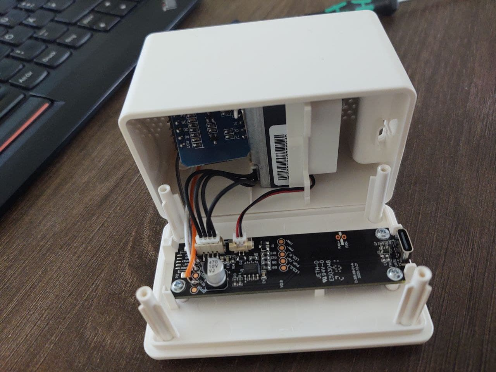
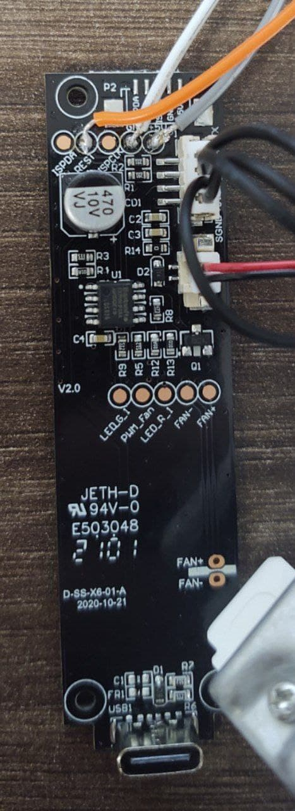
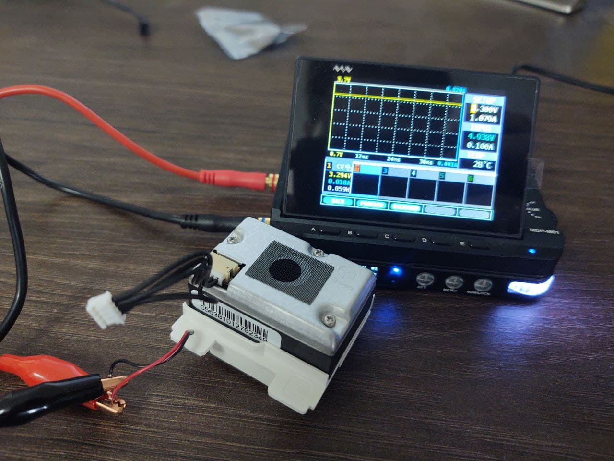

<h2>MQTT connectivity for the Ikea VINDRIKTNING</h2>

This repository contains an ESP8266 firmware, which adds MQTT to the Ikea VINDRIKTNING PM2.5 air quality sensor.
The modification  doesn't interfere with normal operation of the device in any way.
The ESP8266 just adds another data sink beside the colored LEDs.

Home Assistant Autodiscovery is supported.
Furthermore, the WifiManager library is used for on-the-fly configuration.
Also, ArduinoOTA is used, so that firmware updates are possible even with a reassembled device.

As the ESP8266 is 5V-tolerant, this should there shouldn't be any issues, however I haven't had time to test this for longer periods of time.
Therefore, if the ESP burns out after a while, just add a voltage divider or something.

## Prerequisites

To extend your air quality sensor, you will need

- An ESP8266 with a 5v voltage regulator (e.g. a Wemos D1 Mini)
- Some short dupont cables
- A soldering iron
- A long PH0 Screwdriver (e.g. Wera 118022)

Fortunately, there is a lot of unused space in the enclosure, which is perfect for our ESP8266.
Also, everything we need is accessible via easy to solder testpoints.

## Hardware

To install the ESP8266, you need to unscrew the four visible screws in the back of the enclosure.

Then, there are also three screws holding the tiny PCB in place. These aren't necessary to remove since you can solder
in-place, however personally, I'd recommend taking the board out of there since it will be easier to solder without fear
of accidentally melting some plastic.

As you can see in this image, you'll need to solder wires to GND, 5V and the Testpoint that is connected to TX of the
Particle Sensor.

Then just connect these Wires to GND, VIN (5V) and D2 (if you're using a Wemos D1 Mini).

Done.

## Software

The firmware can be built and flashed using the Arduino IDE.

For this, you will need to add ESP8266 support to it by [using the Boards Manager](https://github.com/esp8266/Arduino#installing-with-boards-manager).

Furthermore, you will also need to install the following libraries using the Library Manager:

* ArduinoOTA 1.0.3
* ArduinoJSON 6.10.1
* PubSubClient 2.8.0
* WiFiManager 0.15.0

Just build, flash, and you're done.

When connecting everything up, you should see an open Wi-Fi Access Point to configure your Wi-Fi and MQTT credentials.

## Low-Noise Mod

**Note:** The intent of this section is only to document that this is possible. I don't "recommend" doing this nor do I advise against it. 

As you might've noticed, there's a fan in there, which is audible even multiple meters away.

For some reason, the Ikea uC firmware decides to toggle the fan on and off every minute 
or so causing the noise it makes to change and therefore it constantly stays noticeable.

Good thing is that the Fan does spin up fine with just 3.3V, which means that we can run it constantly from the
voltage regulator of the D1 Mini.

At 3.3V its noise is barely noticeable from 50 cm away.

Having the Fan not connected at all was also tried but proved to mess up all readings completely.

This is of course a more invasive modification than just adding Wi-Fi data logging.
Though, given that it is just a €10 device, I'm fine with that.

To make soldering a bit easier, note that the whole outer metal part of the Micro USB connector of the D1 Mini is
connected to GND.

## Misc

The VINDRIKTNING consists of a custom(?) Cubic PM1006-like Sensor + another uC that does all that LED stuff, which talk
via UART. The uC simply regularly polls the sensor and displays the results.

Therefore, to add Wi-Fi connectivity, we just need to also listen to the TX of the Sensor and decode those messages.
The Ikea uC will do all that polling stuff for us.

As reported in #16, the transitions from Green to Yellow and Yellow to Red in the Ikea firmware are at around 30 and 100μg/m³.
| Color        | Value           | Comment  |
| ------------- |:-------------:| -----:|
| Green      | 0-35 | Good + Low |
| Amber      | 36-85 | Ok + Medium |
| Red      | 86- | Not good + High |
| Pulsing      | --- | Startup mode |

Info from (https://www.ikea.com/us/en/manuals/vindriktning-air-quality-sensor__AA-2289325-1_pub.pdf):

## ToDo

Reconfiguration of a provisioned device without having to OTAU a firmware that clears the settings would be nice.

## References and sources

- [@haxfleisch](https://twitter.com/haxfleisch) for their teardown of the device.
- [Gabriel Valky](https://github.com/gabonator) for the incredibly useful [LA104 custom firmware + tools](https://github.com/gabonator/LA104)
